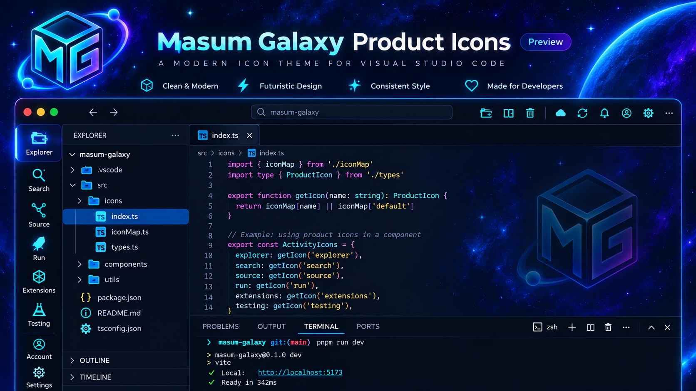

<p align="center">
  
</p>

# Masum Galaxy // Product Icons

A futuristic **VS Code Product Icon Theme** by **Masum Billah**.

**Version 2.1.2 · Premium Galaxy + optional Aurora Hover · Free · MIT**

v2.1 keeps the Premium Galaxy v2 icon system and adds an **optional Aurora hover effect directly inside this Product Icon extension**.

> VS Code's official Product Icon Theme API only defines icon glyphs. Hover animation requires the optional **Custom CSS and JS Loader** extension, so the hover feature is opt-in.

## Premium Galaxy v2

Main Activity Bar:

- Explorer — futuristic folder + orbital ring
- Search — magnifier + spark accent
- Source Control — constellation-style branch nodes
- Run & Debug — rocket
- Extensions — wireframe cube
- Testing — lab flask
- Accounts — profile + orbit
- Settings — hex/reactor gear

Important UI icons include Terminal, Refresh, Sync, Split, Git Branch/Pull/Push, Warning/Info/Error, Notifications, layout controls, navigation, Trash, Preview, Edit, Check, Pin, Cloud, Download, Upload, Database and Debug-Bug.

The custom font contains **41 distinct glyphs** from `U+E001` through `U+E029`, mapped across more than **200 high-value VS Code product icon IDs**.

## Branding

- Marketplace icon: `images/icon.png`
- Hero banner: `images/marketplace-hero.png`
- Marketplace preview: `images/preview.jpg`

## Preview

<p align="center">
  
</p>

The preview uses the actual VS Code setup with **Masum Galaxy // Product Icons** active, framed for a cleaner GitHub / Marketplace presentation.

## Install locally

```powershell
cd "D:\OneDrive\Web Development\Galaxy-VS-Code-Product-Icon"

git pull
npm.cmd install
npx.cmd vsce package

code --install-extension .\masum-galaxy-product-icons-2.1.2.vsix --force
```

Activate the icon theme:

```text
Ctrl + Shift + P
→ Preferences: Product Icon Theme
→ Masum Galaxy // Product Icons
```

## Enable Aurora hover

Open:

```text
Ctrl + Shift + P
```

Run:

```text
Masum Galaxy Product Icons: Enable Aurora Hover
```

If **Custom CSS and JS Loader** is not installed, the command can install it for you.

Then choose:

```text
Apply & Reload Window
```

Hovering Product Icons such as Explorer, Search, Source Control, Run, Extensions, Testing, Account, Settings, Terminal and toolbar actions will then show a cyan → blue → violet Aurora glow.

To disable:

```text
Masum Galaxy Product Icons: Disable Aurora Hover
```

To re-apply after a VS Code update:

```text
Masum Galaxy Product Icons: Reload Aurora Hover
```

## Important note

The Product Icon glyphs themselves use the official VS Code Product Icon Theme API.

The optional hover effect uses **Custom CSS and JS Loader**, which modifies VS Code workbench files. VS Code can therefore show a modified/corrupt-installation warning while custom CSS is active, and Windows may require Administrator permission to apply it.

## Files

```text
images/icon.png
images/marketplace-hero.png
images/preview.jpg
producticons/masum-galaxy-product-icon-theme.json
producticons/masum-galaxy-product-icons.woff
ui/product-icon-hover.css
extension.js
```

## Designed to pair with

- **Masum Galaxy // Future Code**
- **Masum Galaxy // File Icons**

## Repository

https://github.com/gitwithmasum/Galaxy-VS-Code-Product-Icon

## License

MIT
